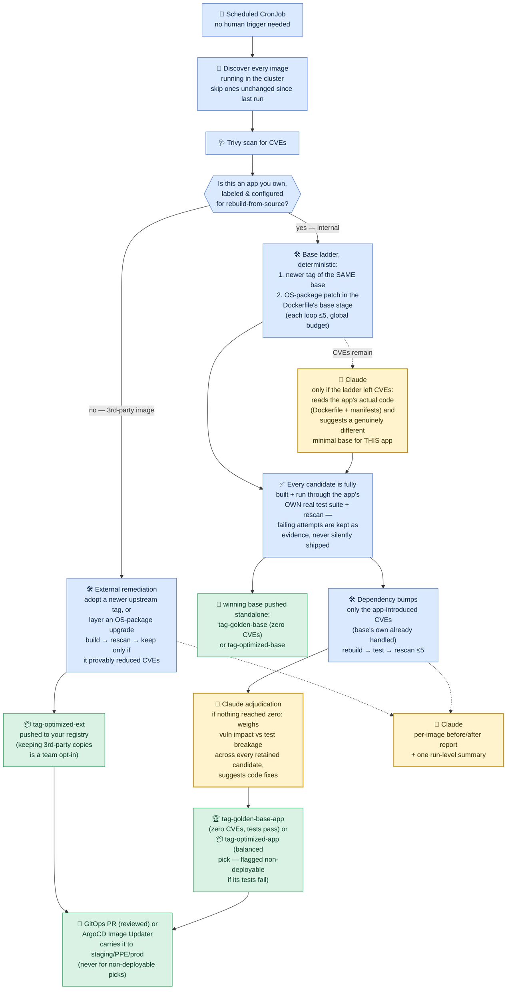

# vuln-agent

An agentic pipeline that automatically scans every Docker image running in a cluster and remediates by ownership: third-party images get deterministic tag bumps and OS-package patches (kept only when a rescan proves improvement), while owned applications are rebuilt from source through bounded agentic loops — Claude-suggested base images and dependency upgrades, every candidate gated by the app's own test suite — producing golden (zero-CVE) base and app images, with Claude adjudicating the best balanced pick when zero isn't reachable and writing the before/after reports.

## Overview — what this does once it's running in your cluster

Deployed as a scheduled Kubernetes CronJob (see `chart/`), with zero manual
triggering: it discovers every image running across your cluster, scans each
one, and only ever reaches for Claude at the four specific points where a
lookup table genuinely can't do the job — everything else (tag bumps, package
upgrades, build/test/rescan verification) is deterministic and Trivy-verified.



**The value this generates, continuously and without manual triage:**
- Every image running in the cluster gets scanned on a schedule, not just once at build time — newly-disclosed CVEs against images that never change still get caught.
- Fixes are applied and *verified* before anything ships — a rescan has to show a real improvement, or the attempt is discarded. Nothing broken ever reaches the registry on the strength of a guess.
- For apps you own, it goes further than patching: it rebuilds from source — a better base image *and* upgraded application dependencies — with every candidate validated against that app's *own* real test suite. A `-golden-base-app` image means **zero CVEs and every change test-verified**, not a hopeful guess; the winning base is *also* published standalone (`-golden-base`/`-optimized-base`) so other apps can adopt it directly.
- Produces a plain-English before/after report and, for higher environments, a reviewable pull request — a human always signs off before anything reaches production.

**Where Claude actually creates value (and only there):**
1. **Suggesting an alternative base image** — but *only* as a fallback, after the deterministic rungs (a same-repo tag bump *and* an OS-package patch, each a bounded ≤5 loop) have already been tried and left CVEs behind. It reads the app's actual code context (the Dockerfile and dependency manifests, plus the list of bases already tried, to prevent cycles) and suggests minimal/distroless candidates for *this* runtime — world-knowledge an LLM has and a static table would constantly fall behind on. Everything upstream and downstream of that one decision (finding the newer tag, patching the Dockerfile, building, testing, rescanning, adopting) is deterministic code.
2. **Adjudicating the balanced pick** — when no candidate reaches zero CVEs with passing tests, Claude weighs every retained attempt (including ones whose tests failed): is fixing a low-impact CVE worth breaking tests? Is eliminating a genuinely critical, reachable CVE worth a code change? It picks the best-balanced candidate with a written justification and concrete code-fix suggestions — but deployability is decided by the actual test result, never by the model, and a failing pick is pushed only as a flagged, non-deployable artifact.
3. **The per-image before/after summary report** — turning a raw CVE diff into a prioritized, readable narrative (what changed, what's left, how to think about the residual risk) is a writing/judgment task, not a lookup.
4. **The run-level summary** — one report per discovery run with an External section (third-party images: improvements, residual risk, mitigation options) and an Internal section (owned apps: base selections, posture improvement, app impact and code-change justifications).

## How it works

Two very different paths, chosen by ownership — a third-party image is only
ever patched at the image layer (no test authority means no rebuild), while an
owned app is rebuilt from source through bounded agentic loops, every candidate
gated by its own test suite.

### External scope — zooming into the `REMED` box above (3rd-party images)

```
Input image
     │
     ▼
┌────────────────────────────────────────────────────────────────────┐
│                 Remediation Loop (per iteration)                   │
│                                                                    │
│   Trivy scan                                                       │
│       │                                                            │
│       ▼                                                            │
│   Newer upstream tag already fixes it?                             │
│       │                                                            │
│       ├── yes ──► adopt it (no build needed)                       │
│       │                                                            │
│       └── no ───► OS-package patch (apk/apt/yum — no LLM)          │
│                       │                                            │
│                       ▼                                            │
│                   docker build ──► rescan                          │
│                       │                                            │
│                       ▼                                            │
│                   improved?                                        │
│                    │      │                                        │
│                   yes     no ──► discard build, stop               │
│                    │                                               │
│                    └──────► loop back to Trivy scan                │
└────────────────────────────────────────────────────────────────────┘
                                 │ clean, or no further patches possible
                                 ▼
        push <tag>-optimized-ext ─► ONE Claude Opus before/after
        to private registry       summary report ──► GitHub Release
```

**Loop termination — first condition wins:**

| Condition | Status |
|-----------|--------|
| Zero HIGH/CRITICAL CVEs remain | `clean` |
| All remaining CVEs require source rebuild (Go binaries, no upstream fix) | `no_further_patches` |
| Patch applied but CVE count did not decrease | `no_improvement` |
| `MAX_ITERATIONS` reached (default: 5) | `max_iterations` |

### Internal scope — the `LADDER` → adjudication boxes above (owned apps)

This is where the agentic looping lives, and where all four LLM call sites sit —
each one a genuinely ambiguous decision, with everything between them
deterministic and Trivy-verified:

```
Owned image (label-selected, source repo + test suite configured)
        |  clone sourceRepo
        v
┌─ PHASE A: base ladder  (<=5 rounds, global budget of 20 attempts) ───────┐
│                                                                          │
│   1. Newer tag of the SAME base        (loop <=5, deterministic)         │
│   2. OS-package patch in the base stage (loop <=5, deterministic)        │
│        |                                                                 │
│        | CVEs remain?                                                    │
│        v                                                                 │
│   3. LLM CALL 1 - base determination from APPLICATION CODE:              │
│      reads the Dockerfile + dependency manifests, suggests minimal       │
│      bases for THIS app (already-tried bases excluded -> no cycles)      │
│        |                                                                 │
│        '--> adopted swap RE-ENTERS steps 1-2 on the new base             │
│                                                                          │
│   EVERY candidate: rebuild -> app's OWN test suite -> Trivy rescan.      │
│   Adopted only on a severity improvement (CRITICAL, then HIGH);          │
│   failures are rolled back byte-for-byte but RETAINED as evidence.       │
│                                                                          │
└──────────────────────────────────────────────────────────────────────────┘
        |
        |  winning base ALSO built standalone + scanned:
        |--> <base>:<base-tag>-golden-base (zero CVEs)
        |         or -optimized-base (reduced)
        v
┌─ PHASE B: dependency loop  (<=5 passes) ─────────────────────────────────┐
│                                                                          │
│   Targets ONLY app-introduced CVEs (the base's own are subtracted).      │
│   Bump to Trivy's exact fixed versions (requirements.txt /               │
│   package.json / go.mod / pom.xml) -> rebuild -> test -> rescan,         │
│   stopping at the first non-improvement.                                 │
│                                                                          │
└──────────────────────────────────────────────────────────────────────────┘
        |
        v
┌─ PHASE C: outcome ───────────────────────────────────────────────────────┐
│                                                                          │
│   Zero TOTAL CVEs + tests passing                                        │
│       '--> <tag>-golden-base-app  (strict golden)                        │
│                                                                          │
│   Otherwise LLM CALL 2 - balanced adjudication across EVERY              │
│   retained candidate (passing and failing): weighs vulnerability         │
│   impact vs test breakage, suggests concrete code fixes                  │
│       '--> <tag>-optimized-app  (flagged NON-DEPLOYABLE if the           │
│            pick's tests failed - the GitOps PR never fires for it)       │
│                                                                          │
└──────────────────────────────────────────────────────────────────────────┘
        |
        v
LLM CALL 3 - per-image before/after report
LLM CALL 4 - run-level summary (discovery mode: External + Internal
             sections across every image scanned this run)
```

Internal runs end in `golden_base_app` (zero total CVEs, tests passing),
`optimized_app` (best balanced pick), or `no_improvement` (nothing pushed).
Configuration, onboarding, and the test-stage-lineage requirement are covered in
[Base image hardening](#base-image-hardening--golden-images-for-owned-applications).

**Output artifacts per run:**

Only the baseline scan and one final summary are kept per image — no
per-iteration files. At most one final app image reaches the registry per run
(plus, for internal runs, the winning base published standalone):

| Artifact | Description |
|----------|-------------|
| `output/scan-baseline.json` | Full Trivy JSON output from the first scan, before any changes |
| `output/summary-report.md` | Claude Opus 4.8 before/after remediation summary covering the whole image's run |
| `output/run-summary.md` | Discovery mode only: one Claude-composed run-level report — External + Internal sections across every image scanned this run |
| GitHub Release | The files above attached as downloadable release assets — the immutable audit archive |
| Reports repo (optional) | With `REPORTS_REPO` set, every report is *also* committed as rendered, diffable markdown: `reports/<repo>/<tag>/<date>-summary.md` + a stable `reports/<repo>/<tag>/latest.md` per image, and `reports/run-summary/` for discovery runs — the place for humans to read and study results |
| Promotion PR body | The per-image summary is folded into the GitOps promotion PR (collapsed section), so reviewers see the security story where they approve the change |
| Code-fix issue | A non-deployable balanced pick files the adjudication's `code_fixes` as a GitHub Issue on the app's own source repo (stable title — re-runs comment instead of duplicating) |
| Final image | External: `<name>:<original-tag>-optimized-ext` (any real improvement, incl. a tag bump alone reaching zero — gated by `KEEP_EXTERNAL_IMAGES`). Internal: `-golden-base-app` (zero CVEs, tests passing) or `-optimized-app` (best balanced pick) — plus the winning base standalone as `-golden-base`/`-optimized-base` |

Push policy:
- Nothing to patch on the first scan → no image pushed, the run is already clean.
- Any external improvement — a tag bump (even one that alone reaches zero
  vulnerabilities), an OS-package patch, or both — is pushed as
  `<name>:<original-tag>-optimized-ext`, unless `KEEP_EXTERNAL_IMAGES=false`
  (keeping third-party copies is a team decision; internal images always keep
  their result).
- An internal `-optimized-app` whose tests failed (a deliberate balanced pick —
  e.g. a critical CVE eliminated at the cost of a test that needs a code fix)
  is still pushed as evidence, but flagged **non-deployable** in the report and
  never promoted by the GitOps PR-bot.

---

## Prerequisites

| Tool | Purpose | Install |
|------|---------|---------|
| Python 3.12+ | Runtime | [python.org](https://www.python.org/downloads/) |
| Trivy | Vulnerability scanning | [trivy.dev](https://trivy.dev/latest/getting-started/installation/) |
| Docker CLI | Build and push patched images | [docs.docker.com](https://docs.docker.com/engine/install/) |
| Anthropic API key | Claude Opus 4.8 (final before/after summary report) | [console.anthropic.com](https://console.anthropic.com/) |
| GitHub PAT | Create releases, push artifacts | Scopes: `repo` + `write:packages` |

---

## Running locally

### 1. Clone and create a virtual environment

```bash
git clone https://github.com/sgrsaga/vuln-agent.git
cd vuln-agent

python3 -m venv .venv
source .venv/bin/activate        # Windows: .venv\Scripts\activate
pip install -r requirements.txt
```

### 2. Install Trivy

```bash
# Linux / macOS
curl -sfL https://raw.githubusercontent.com/aquasecurity/trivy/main/contrib/install.sh \
  | sh -s -- -b /usr/local/bin latest

# macOS (Homebrew)
brew install trivy
```

### 3. Configure environment variables

```bash
cp .env.example .env
# Edit .env with your values
```

| Variable | Required | Description |
|----------|----------|-------------|
| `ANTHROPIC_API_KEY` | Yes | Your Anthropic API key (`sk-ant-...`) |
| `GHCR_NAMESPACE` | No | Registry prefix for pushed images, e.g. `ghcr.io/myorg`. Leave empty to build locally only |
| `GITHUB_TOKEN` | No | GitHub PAT (`ghp_...`) with `repo` + `write:packages` scopes. Enables GitHub Release creation |
| `GITHUB_REPO` | No | `owner/repo` or full GitHub URL. Required for release creation |
| `TARGET_NAMESPACES` | No | Discovery mode: comma-separated namespace whitelist. Takes priority over `EXCLUDED_NAMESPACES`. Also settable via `--namespaces` |
| `EXCLUDED_NAMESPACES` | No | Discovery mode: comma-separated namespace blacklist, used only when `TARGET_NAMESPACES` is empty. Also settable via `--exclude-namespaces` |
| `INCLUDE_INIT_CONTAINERS` | No | Discovery mode: also scan images running in init containers (default: `false`) |
| `MAX_ITERATIONS` | No | Safety cap on remediation loops (default: `5`) |
| `OUTPUT_DIR` | No | Directory for artifacts (default: `output`) |
| `ALLOW_MAJOR_TAG_BUMP` | No | Allow the base-image tag-bump check to cross a major version when hunting for a tag that already fixes CVEs (default: `false` — patch/minor bumps only) |
| `RESCAN_INTERVAL_DAYS` | No | Discovery mode only: rescan an image again after this many days even if it hasn't changed (default: `7`) |
| `FORCE_RESCAN` | No | Discovery mode only: ignore tracked scan state and rescan every discovered image this run (default: `false`) |
| `GITOPS_REPO` | No | `owner/repo` of a GitOps manifests repo to open promotion PRs against. Leave empty to disable (see [Promoting optimized images](#promoting-optimized-images-to-higher-environments)) |
| `GITOPS_TOKEN` | No | PAT with access to `GITOPS_REPO`. Falls back to `GITHUB_TOKEN` if unset |
| `GITOPS_BASE_BRANCH` | No | Branch to open promotion PRs against (default: `main`) |
| `GITOPS_IMAGE_PATH_TEMPLATE` | No | Path within `GITOPS_REPO` to patch, e.g. `environments/ppe/{repo_name}/values.yaml` — `{repo_name}` is filled in per image |
| `REPORTS_REPO` | No | `owner/repo` to commit summary reports into for browsing/diffing (dated file + stable `latest.md` per image). Empty disables — reports then live only on releases/PVC |
| `REPORTS_BRANCH` | No | Branch in `REPORTS_REPO` to commit to (default `main`) |
| `REPORTS_TOKEN` | No | PAT with access to `REPORTS_REPO`. Falls back to `GITHUB_TOKEN` if unset |
| `CODE_FIX_ISSUES` | No | File the adjudication's code-fix suggestions as a GitHub Issue on the app's source repo when a balanced pick is non-deployable (default `true`) |
| `OWNED_IMAGE_LABEL_SELECTOR` | No | k8s label selector identifying owned images eligible for base-image hardening (discovery mode only). Empty disables hardening entirely |
| `HARDENING_CONFIG` | No | JSON list mapping owned repos to source/test config — see [Base image hardening](#base-image-hardening-golden-images-for-owned-applications) |
| `HARDENING_MAX_CANDIDATES` | No | Max alternative base images to try per image (default: `3`) |
| `HARDEN_BASE_IMAGE` | No | Single-image mode only: opt-in to hardening (`--harden`). Discovery mode uses `OWNED_IMAGE_LABEL_SELECTOR` instead (default: `false`) |

### 4. Log in to your private registry

```bash
# GitHub Container Registry
echo "$GITHUB_TOKEN" | docker login ghcr.io -u YOUR_GITHUB_USERNAME --password-stdin

# Any other registry (AWS ECR, GCP Artifact Registry, Docker Hub, etc.)
docker login your.registry.io
```

### 5. Pre-warm Trivy (first run only)

On the first run Trivy downloads its vulnerability database (~600 MB). Pre-download it once to avoid a timeout during the scan:

```bash
trivy image --download-db-only
```

### 6. Run the agent

```bash
source .venv/bin/activate

python main.py ghcr.io/dexidp/dex:v2.45.1
```

Or with explicit flags:

```bash
python main.py ghcr.io/your-org/your-image:tag \
  --max-iterations 3 \
  --output-dir /tmp/scan-results
```

### 7. View results

Artifacts are written to `output/` in real time — only the baseline scan and the
final summary, regardless of how many iterations the run takes internally. If
`GITHUB_TOKEN` and `GITHUB_REPO` are configured, a GitHub Release is created at
the end of every run with both files attached.

```
output/
├── scan-baseline.json     ← full Trivy scan from before any changes (63 KB)
└── summary-report.md      ← Claude before/after remediation summary (12–15 KB)
```

Example output for `ghcr.io/dexidp/dex:v2.45.1`:

```
🚀  [pipeline_start] Starting remediation for ghcr.io/dexidp/dex:v2.45.1
🔍  [scan_complete] Found 104 vulnerabilities (CRITICAL: 11, HIGH: 93)
🏷️  [tag_bump_unavailable] No newer upstream tag improves on current CVEs
🔧  [patch_generated] Patch Dockerfile generated (4 lines)
✅  [improvement] Reduced by 15: 104 → 89 effective CVEs
🔍  [scan_complete] Found 89 vulnerabilities (CRITICAL: 9, HIGH: 80)
🏁  [pipeline_complete] No further patches possible — remaining CVEs require source rebuild
✅  [final_image] Final optimized image: ghcr.io/sgrsaga/dex:v2.45.1-optimized-ext
ℹ️  [summary_start] Generating before/after summary report with Claude Opus 4.8 ...
```

---

## Running in a Kubernetes cluster

The agent runs as a Kubernetes **Job** (one-shot on demand) or **CronJob** (automated schedule). It mounts the node's Docker socket to build and push images without needing a Docker daemon inside the pod.

Two deployment paths, pick one:

- **Option A — Helm chart (`chart/`, recommended)**: the actively-developed
  path — discovery mode, SealedSecrets, whitelist namespace model, all
  parameters in one `values.yaml`.
- **Option B — raw manifests (`k8s/`)**: step-by-step `kubectl apply`, useful
  when Helm isn't available or you want to see every moving part.

### Cluster architecture

```
┌────────────────────────────────────────────────────────┐
│  Kubernetes namespace: security                        │
│                                                        │
│  ┌─────────────────────────────────────────────────┐  │
│  │  Job / CronJob pod                              │  │
│  │                                                 │  │
│  │  [init] trivy --download-db-only               │  │
│  │                                                 │  │
│  │  [main] vuln-agent                             │  │
│  │    ├── Trivy scan          (local process)      │  │
│  │    ├── Claude API calls    (HTTPS outbound)     │  │
│  │    ├── docker build        (via host socket)    │  │
│  │    └── docker push         (HTTPS outbound) ───┼──┼──► Private registry
│  │                                                 │  │    (GHCR / ECR / GCR / ACR)
│  │  Volumes:                                       │  │
│  │    /var/run/docker.sock   ← hostPath            │  │
│  │    /root/.docker/config   ← registry secret     │  │
│  │    /app/output            ← PVC (artifacts)      │  │
│  │    /trivy-cache           ← PVC (Trivy DB)       │  │
│  └─────────────────────────────────────────────────┘  │
└────────────────────────────────────────────────────────┘
          │
          └──► GitHub Releases API (artifacts uploaded at end of run)
```

### Option A — Helm chart (recommended)

#### A1 — Build and push the agent image

```bash
docker build -t ghcr.io/your-org/vuln-agent:latest .
docker push ghcr.io/your-org/vuln-agent:latest
```

Set the reference in `chart/values.yaml` under `image:` — pin by `digest` (as
the checked-in values do) or by `tag`.

#### A2 — Credentials

The chart expects two secrets in the release namespace:

- `vuln-agent-secrets` — keys `anthropic-api-key` and `github-token`
- `vuln-agent-registry` — a `kubernetes.io/dockerconfigjson` secret for
  pulling the agent image and pushing remediated images

**With SealedSecrets** (how this repo manages them —
`chart/sealed-secrets.yaml` holds both, encrypted for the cluster's
controller):

```bash
kubectl create namespace vuln-agent   # SealedSecrets are namespace-bound — this must match
kubectl apply -f chart/sealed-secrets.yaml
```

To re-seal for your own cluster/namespace, follow the `kubeseal` commands in
the header of `chart/sealed-secrets.yaml`.

**Without SealedSecrets** (quick start), create them directly:

```bash
kubectl create namespace vuln-agent
kubectl -n vuln-agent create secret generic vuln-agent-secrets \
  --from-literal=anthropic-api-key=sk-ant-... \
  --from-literal=github-token=ghp_...
kubectl -n vuln-agent create secret docker-registry vuln-agent-registry \
  --docker-server=ghcr.io \
  --docker-username=YOUR_GITHUB_USERNAME \
  --docker-password=ghp_...
```

(Alternatively pass `anthropic.apiKey`/`github.token`/`registry.username`+
`registry.password` as values and the chart renders the secrets itself —
convenient, but the credentials then live in your values file.)

#### A3 — Configure `chart/values.yaml`

The key decisions (everything else has sane defaults):

```yaml
image:
  repository: ghcr.io/your-org/vuln-agent   # from A1

registry:
  namespace: "ghcr.io/your-org"    # where remediated images get pushed

github:
  repo: "your-org/your-repo"       # GitHub Releases land here

discovery:
  targetNamespaces: [apps, monitoring]   # whitelist of namespaces to scan
  ownedImageLabelSelector: "vuln-agent.io/harden=true"  # enables internal hardening

docker:
  hostSocketPath: "/var/run/docker.sock"  # REQUIRED for builds — empty = analysis-only
                                          # mode (scan + classify + reports, no build/push)

persistence:
  output:      { storageClass: "your-storageclass" }
  trivyCache:  { storageClass: "your-storageclass" }

reports:
  repo: "your-org/security-reports"  # optional: commit reports for browsing/diffing

schedule: "0 2 * * *"                # discovery CronJob cadence
```

#### A4 — Install

```bash
helm lint chart/
helm upgrade --install vuln-agent chart/ -n vuln-agent --create-namespace -f chart/values.yaml
```

The release's NOTES print the trigger/log/artifact commands. RBAC
(ServiceAccount + cluster pod-read for discovery), PVCs, ConfigMap, and the
discovery-mode CronJob are all created by the chart.

#### A5 — Trigger a run now (instead of waiting for the schedule)

```bash
kubectl -n vuln-agent create job vuln-scan-manual --from=cronjob/vuln-agent
kubectl -n vuln-agent logs -f job/vuln-scan-manual
```

#### A6 — Results, upgrades, removal

```bash
# Artifacts: output PVC (scan-baseline.json + summary-report.md per image,
# run-summary.md per run), the GitHub Release, and — when reports.repo is
# set — rendered markdown committed to that repo.

# Apply a values change / new chart version
helm upgrade vuln-agent chart/ -n vuln-agent -f chart/values.yaml

# Remove (PVCs are kept by Helm — delete them explicitly if you want the
# scan state and artifacts gone too)
helm uninstall vuln-agent -n vuln-agent
```

### Option B — raw manifests (`k8s/`)

> **Switching between options?** Both paths create cluster-scoped RBAC named
> `vuln-agent`, so they can't coexist. Moving from B to A: first
> `kubectl delete clusterrole vuln-agent clusterrolebinding vuln-agent`
> (and the old CronJob in `security`), or `helm install` fails with an
> "invalid ownership metadata" error on the ClusterRole.

#### Step 1 — Build and push the agent image

```bash
# Build
docker build -t ghcr.io/your-org/vuln-agent:latest .

# Push to your registry
docker push ghcr.io/your-org/vuln-agent:latest
```

#### Step 2 — Create namespace, persistent storage, and RBAC

```bash
kubectl apply -f k8s/namespace.yaml
kubectl apply -f k8s/pvc.yaml
kubectl apply -f k8s/rbac.yaml    # ServiceAccount + cluster pod-read — needed by the discovery CronJob
```

Two PVCs are created:
- `vuln-agent-output` (1 Gi) — scan JSON, reports, Dockerfiles
- `vuln-agent-trivy-cache` (2 Gi) — Trivy vulnerability DB (avoids re-downloading on every run)

#### Step 3 — Create secrets

```bash
# Anthropic API key + GitHub token
kubectl -n security create secret generic vuln-agent-secrets \
  --from-literal=anthropic-api-key=sk-ant-... \
  --from-literal=github-token=ghp_...

# Registry credentials so the agent can push patched images
kubectl -n security create secret docker-registry ghcr-credentials \
  --docker-server=ghcr.io \
  --docker-username=YOUR_GITHUB_USERNAME \
  --docker-password=ghp_...
```

For other registries replace `--docker-server` with your registry hostname (e.g. `123456789.dkr.ecr.us-east-1.amazonaws.com`).

#### Step 4 — Configure the manifests

Edit `k8s/job.yaml` (and `k8s/cronjob.yaml` if using scheduled scans). The key fields to change:

```yaml
# --- k8s/job.yaml ---

containers:
  - name: vuln-agent
    # ① Your agent image (built in Step 1)
    image: ghcr.io/your-org/vuln-agent:latest

    # ② The target image to scan
    args: ["ghcr.io/your-org/your-image:your-tag"]

    env:
      # ③ Where to push patched images
      - name: GHCR_NAMESPACE
        value: "ghcr.io/your-org"             # or your.registry.io/your-org

      # ④ Where to publish GitHub Release artifacts
      - name: GITHUB_REPO
        value: "your-org/your-repo"

      # ⑤ Max iterations (optional)
      - name: MAX_ITERATIONS
        value: "5"
```

Both manifests now carry the full parameter set with commented defaults —
discovery scope (`TARGET_NAMESPACES`/`EXCLUDED_NAMESPACES`), external tuning
(`ALLOW_MAJOR_TAG_BUMP`, `KEEP_EXTERNAL_IMAGES`, `RESCAN_INTERVAL_DAYS`),
internal loop budgets (`LLM_BASE_MAX_ROUNDS`, `DEP_UPGRADE_MAX_ITERATIONS`,
`INTERNAL_MAX_ATTEMPTS`), hardening selection (`OWNED_IMAGE_LABEL_SELECTOR` +
`HARDENING_CONFIG` in the CronJob; `HARDEN_BASE_IMAGE` opt-in in the one-shot
Job), and the GitOps PR-bot (`GITOPS_*`) — the same knobs as `.env.example`
and the Helm chart's ConfigMap.

#### Step 5 — Run a one-shot Job

```bash
kubectl apply -f k8s/job.yaml

# Stream live logs
kubectl -n security logs -f job/vuln-remediate-dex

# Check completion status
kubectl -n security get job vuln-remediate-dex
```

#### Step 6 — Schedule automatic scans (CronJob)

```bash
kubectl apply -f k8s/cronjob.yaml
```

The CronJob runs in **discovery mode** (`--discover`): it lists every image
running in the cluster via the `vuln-agent` ServiceAccount from Step 2, scoped
by `TARGET_NAMESPACES` (whitelist — wins when set) or `EXCLUDED_NAMESPACES`
(blacklist). Images whose pods match `OWNED_IMAGE_LABEL_SELECTOR` and have
hardening config (annotations or `HARDENING_CONFIG`) take the internal
rebuild-from-source path; everything else gets external tag-bump + OS-patch
treatment.

The default schedule is **every Monday at 04:00 UTC**. To change it, edit `spec.schedule` in `k8s/cronjob.yaml` using standard cron syntax:

```yaml
schedule: "0 4 * * 1"   # Mon 04:00 UTC
schedule: "0 2 * * *"   # Every day at 02:00 UTC
schedule: "0 0 1 * *"   # First day of every month
```

Each run tracks what it already scanned in `<output-dir>/.vuln-agent-state/tracked-images.json`
on the `output` PVC, keyed by image digest. On the next scheduled run, an image is
skipped — not rescanned — if its digest hasn't changed and it was last checked within
`RESCAN_INTERVAL_DAYS` (default 7); it's rescanned regardless of digest if the prior
attempt errored out, or once the TTL passes, so a workload that never gets redeployed
still gets rechecked periodically against newly-disclosed CVEs. Set `FORCE_RESCAN=true`
(or `--force-rescan`) to ignore this and rescan everything on a given run.

Trigger a scan immediately without waiting for the schedule:

```bash
kubectl -n security create job vuln-scan-manual \
  --from=cronjob/vuln-agent-scan
```

List all runs and their status:

```bash
kubectl -n security get jobs -l app=vuln-agent
```

### Retrieve artifacts from the cluster

If `GITHUB_TOKEN` and `GITHUB_REPO` are set, all artifacts are automatically uploaded to a GitHub Release — no manual retrieval needed. The release URL is printed in the pod logs.

To access artifacts stored on the PVC directly:

```bash
kubectl -n security run artifact-reader --rm -it \
  --image=busybox \
  --overrides='{
    "spec": {
      "volumes": [{"name":"out","persistentVolumeClaim":{"claimName":"vuln-agent-output"}}],
      "containers": [{
        "name":"reader","image":"busybox","command":["sh"],
        "volumeMounts":[{"name":"out","mountPath":"/output"}]
      }]
    }
  }'

# Inside the shell:
ls -lh /output
cat /output/summary-report.md
```

---

## What gets fixed automatically — and what does not

### Fixed automatically (OS / distro packages)

When Alpine, Debian, or Ubuntu packages have a newer version available:

```dockerfile
FROM your-image:tag
USER root
RUN apk upgrade --no-cache      # Alpine
# or: RUN apt-get update && apt-get upgrade -y    # Debian/Ubuntu
USER original-user
```

### Cannot be fixed at the image layer (requires source rebuild)

**Go binary CVEs** — the vulnerable code is statically compiled into the binary. No package manager can update it. Fixing requires:

1. Bumping Go module dependencies in the source repository
2. Rebuilding the binary with an updated Go toolchain
3. Releasing a new upstream image version

The agent identifies these, documents them clearly in the report, and stops iterating rather than applying ineffective patches. The report includes the exact `go get` commands needed for a source-level fix.

---

## Promoting optimized images to higher environments

Pushing the final image (`-optimized-ext` / `-golden-base-app` / `-optimized-app`) is where this agent's job
ends — nothing in this repo rewrites a deployment manifest to actually reference
it. That's intentional: how an optimized image flows from where it was scanned
(typically a low-trust dev/sandbox environment) into staging, PPE, and production
is an environment-promotion decision, not a scanning one, and different tiers
usually want different levels of friction. Two complementary paths:

### Lower environments — ArgoCD Image Updater (no code here, just config)

[ArgoCD Image Updater](https://argocd-image-updater.readthedocs.io/) is a separate
controller that polls the registry directly and writes updates back itself — this
agent never talks to it. Install it once, then annotate the *target application's*
`Application` resource (in whatever repo/cluster that lives in — not this chart):

```yaml
metadata:
  annotations:
    argocd-image-updater.argoproj.io/image-list: myapp=ghcr.io/me/argocd
    # These tags are fixed and get overwritten in place by each
    # remediation run — it's not a growing semver series — so "digest" (poll
    # the same tag, redeploy when its digest changes) is the right update
    # strategy here, not "semver".
    argocd-image-updater.argoproj.io/myapp.update-strategy: digest
    # Base artifacts (-golden-base/-optimized-base) are building blocks, not
    # app deployables — deliberately NOT matched here. Nor is -optimized-app:
    # it can carry a non-deployable balanced pick, so route it through the
    # reviewed PR-bot path below instead of auto-deploying it.
    argocd-image-updater.argoproj.io/myapp.allow-tags: regexp:^.*-(optimized-ext|golden-base-app)$
    argocd-image-updater.argoproj.io/write-back-method: git
```

Image Updater needs read access to the same registry `GHCR_NAMESPACE` already
pushes to — reuse the existing pull secret. This writes back automatically, with
no human review by default, which is fine for fast-moving lower environments but
not usually what you want pointed straight at production.

### Higher environments (PPE/Prod) — the built-in PR-bot

Set `GITOPS_REPO` (and `GITOPS_IMAGE_PATH_TEMPLATE`) and the agent will, after
promoting a final optimized image, patch that path in `GITOPS_REPO` and open a
PR — it never merges anything itself, so a human always reviews the change before
it reaches a gated environment. Re-runs that produce the same result update the
existing open PR (a stable `vuln-agent/optimize-<repo>` branch) instead of piling
up duplicates. See the `GITOPS_*` variables in [step 3](#3-configure-environment-variables)
above for the full configuration.

---

## Base image hardening — "golden images" for owned applications

Everything described above operates on an image that already exists: tag-bumping
adopts a newer *upstream* tag, OS-package patching upgrades packages on the
*current* base. Neither ever changes which base image an app is built FROM,
because doing that safely requires rebuilding from source and proving the app
still works — which this agent will only ever attempt for images your
organization actually owns and can test. It is **never** attempted for
third-party/vendor images (e.g. `ghcr.io/dexidp/dex:v2.45.1`) — rebuilding
someone else's software from source with a swapped dependency, with no access to
their test suite, forfeits their QA and provenance guarantees and leaves you
maintaining an unofficial fork with no real confidence it still behaves
correctly. See `agent/hardener.py` for the full rationale.

### How an image becomes eligible

Two things both have to be true:
1. **It's owned.** Set `discovery.ownedImageLabelSelector` (a standard k8s label
   selector, e.g. `vuln-agent.io/harden=true`) in `chart/values.yaml`. App teams
   self-service by labeling their own Deployments — nothing to edit centrally
   per app. (Single-image mode has no pod/label context, so it's explicit
   opt-in instead: `--harden` / `HARDEN_BASE_IMAGE=true`.)
2. **It has enough config to work with** — where the source repo, Dockerfile
   path, and test stage/command live. Two ways to provide this, and they merge
   (annotation values win field-by-field over a matching central entry, so a
   platform team can still set defaults while apps override what they need):

   **Self-service — annotations on the app's own Deployment** (no separate file
   to touch, ever — the config travels with the workload):
   ```yaml
   metadata:
     labels:
       vuln-agent.io/harden: "true"
     annotations:
       vuln-agent.io/source-repo: myorg/myapp
       vuln-agent.io/dockerfile-path: Dockerfile   # monorepo? point into it: myapp/Dockerfile
       vuln-agent.io/test-stage: test
       # vuln-agent.io/test-command: pytest   # fallback if there's no dedicated test stage
   ```

   `dockerfile-path` is relative to the clone root, and the agent builds the
   Dockerfile's directory as the context — so the app can be the whole repo or
   one subdirectory of a monorepo.

   **Central — `hardening.images` in `chart/values.yaml`**, keyed by bare image
   repo name (useful for apps that haven't added annotations yet, or as a
   platform-managed default):
   ```yaml
   hardening:
     images:
       - repo: myapp
         sourceRepo: myorg/myapp   # cloned to rebuild against a candidate base
         dockerfilePath: Dockerfile
         testStage: test            # `docker build --target test` is the pass/fail signal
         # testCommand: "pytest"    # fallback if there's no dedicated test stage
   ```

   See `target-apps/` in this repo for five complete, working examples (Python,
   Go, Java, Node.js, TypeScript) with Dockerfiles structured to satisfy the
   test-stage-lineage requirement below — good references when onboarding a
   real app.

### What happens for an eligible image

1. `sourceRepo` is cloned, and the Dockerfile's actual current base is read —
   whichever stage the `FROM` line for the *final built image* actually
   resolves to (a plain `docker build` produces the last stage in the file,
   so that's the one Trivy's scan and `current_vulns` describe). If that stage
   is itself just an alias to an earlier one (`FROM base AS runtime`), the
   alias chain is walked backwards until it lands on a real image reference —
   correctly leaving earlier build-only stages alone even when they use a
   completely different base (e.g. a `golang:1.21 AS builder` stage feeding a
   binary into a separate `alpine:3.18 AS runtime` stage never gets touched,
   since it doesn't ship in the built image at all).
2. The **base ladder** runs — cumulative, every candidate validated by
   rebuild → the app's real test suite → rescan, with the Dockerfile rolled
   back byte-for-byte on failure so a losing edit never leaks into the next
   attempt. Failing attempts are *retained as evidence* (image, test result,
   vuln snapshot) for the adjudication step below, not silently discarded:
   - **Rung 1 (deterministic, loop ≤ 5)** — is there just a newer tag of this
     *same* base repo? Reuses the same Trivy-verified tag-bump logic the
     external loop already uses (`agent/tag_finder.py`).
   - **Rung 2 (deterministic, loop ≤ 5)** — the OS-package upgrade
     (`apk`/`apt`/`yum`) injected into the Dockerfile's base stage — the same
     fix external images get, but here it's *test-verified* instead of
     rescan-only.
   - **Rung 3 (Claude)** — only if rungs 1–2 left CVEs behind: up to
     `hardening.maxCandidates` alternative bases for this specific app, chosen
     from its actual code context (Dockerfile + dependency manifests) with
     already-tried bases excluded to prevent cycles. Each adopted swap re-runs
     rungs 1–2 on the new base, up to `LLM_BASE_MAX_ROUNDS` (default 5) rounds,
     all under a global `INTERNAL_MAX_ATTEMPTS` (default 20) build/test/rescan
     budget.
   The winning base is then built **standalone** and scanned: zero CVEs →
   pushed as `<base-repo>:<base-tag>-golden-base`, otherwise
   `-optimized-base` — a curated base other owned apps can adopt directly.
3. CVEs the standalone base scan *doesn't* show are application-introduced by
   definition — the **dependency loop** targets exactly that delta, bumping to
   the fixed versions Trivy reports (requirements.txt / package.json / go.mod /
   pom.xml), then rebuild → test → rescan, repeating until no further
   improvement (`DEP_UPGRADE_MAX_ITERATIONS`, default 5).
4. Outcome: **zero total CVEs with tests passing → `<original-tag>-golden-base-app`**
   (strict golden — nothing residual hides behind the name). Otherwise Claude
   **adjudicates across every retained attempt** — weighing vulnerability
   impact against test breakage and implied code impact, with concrete
   code-fix suggestions when a security fix breaks the app — and the balanced
   pick is pushed as `<original-tag>-optimized-app`. Deployability comes from
   the actual test result, never the model: a failing pick is flagged
   **non-deployable** in the report and the GitOps PR-bot never fires for it.
   No improvement at all → nothing pushed, and the summary report lists every
   step tried and why each failed.

### A residual limitation: your `test`/`testStage` needs to share lineage with the runtime stage

Hardening only ever rewrites the base of the stage that becomes the *final*
image. If your test stage is built from an unrelated base rather than
descending from that same stage (e.g. `FROM golang:1.21 AS test` running unit
tests, feeding into a completely separate `FROM alpine:3.18 AS runtime`), the
test run never actually exercises the new candidate base — it validates the
*old* environment while the *shipped* image gets the swapped one. Structure
`test` to build on top of the runtime stage (`FROM runtime AS test`, or an
earlier stage in the runtime's own lineage) so a passing test run is real
evidence about the image that's actually about to be pushed.

### Isolation — a known, documented limitation

Test execution (`testCommand` path) runs as `docker run --rm --network none` —
no network interface at all, so a compromised or malicious test suite in a
cloned repo can't exfiltrate the agent's mounted credentials to an external
host. This is a real but partial mitigation, **not full sandboxing** — it still
shares the docker daemon and host kernel with the agent. A dedicated,
minimally-privileged k8s Job per hardening attempt would be the proper
production-grade isolation; it isn't built yet, so treat `sourceRepo` as a
trusted input, not an arbitrary/untrusted one, until that lands.

---

## Security considerations for production

The Job manifests mount `/var/run/docker.sock` from the host node, which gives root-equivalent access to the Docker daemon. For production deployments:

- **Dedicated nodes** — use a `nodeSelector` or taint/toleration to confine socket-mounting pods to designated build nodes
- **Namespace policy** — use OPA Gatekeeper or Kyverno to restrict `hostPath` mounts to the `security` namespace only
- **Rootless builds** — replace the Docker socket with **[Kaniko](https://github.com/GoogleContainerTools/kaniko)** for fully rootless in-cluster image builds (no socket mount required)
- **Secret rotation** — rotate `ANTHROPIC_API_KEY` and `GITHUB_TOKEN` regularly; use External Secrets Operator, HashiCorp Vault, or your cloud provider's secret manager to inject them rather than storing them in Kubernetes Secrets directly

---

## Project structure

```
vuln-agent/
├── agent/
│   ├── scanner.py        # Trivy wrapper — runs scan, parses JSON
│   ├── tag_finder.py     # Finds a newer upstream tag that already fixes CVEs
│   ├── patcher.py        # Deterministic OS-package-upgrade Dockerfile (no LLM)
│   ├── builder.py        # docker build/tag/push + crane copy to private registry
│   ├── reporter.py       # Claude Opus 4.8 — the one before/after Markdown summary
│   ├── promoter.py       # Opens a GitOps promotion PR for higher environments
│   ├── hardener.py       # Golden base image hardening for owned applications
│   ├── image_tracker.py  # Discovery-mode state: skip unchanged images
│   ├── discoverer.py     # Lists images running across cluster namespaces
│   ├── publisher.py      # Writes artifacts to disk; creates GitHub Release via REST API
│   └── orchestrator.py   # Main remediation loop and termination logic
├── chart/                # Helm chart — the actively-developed k8s deployment path
├── k8s/                  # Legacy raw Job/CronJob manifests (see README's k8s section)
├── .github/
│   └── workflows/
│       └── vuln-remediate.yml  # GitHub Actions workflow (manual trigger)
├── Dockerfile            # Agent container image
├── .dockerignore
├── main.py               # CLI entry point
├── requirements.txt
└── .env.example
```
